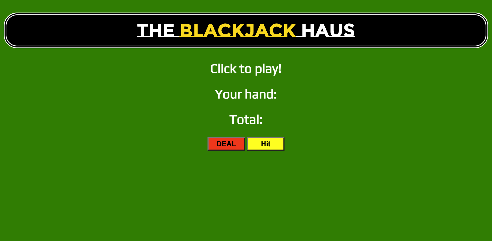

# The Blackjack Haus 

The Blackjack Haus is an online remake (browser-based game) of the original "blackjack" card game. 

</img>

## Game Play

The game will only have one player. The object of the game is for the player to reach the sum of 21. Player must "hit" until blackjack is achieved, which will end the game.

## Technologies Used

- HTML
- CSS
- Javascript

## Getting Started

The following link will allow you to render the game in browser:

https://kjissa.github.io/blackjack-haus/

## Next Steps?

For the future, I will try to include a dealer's hand and/or more users, to make the game a more enjoyable experience. Will also add some background sounds and images to better appeal to users.

